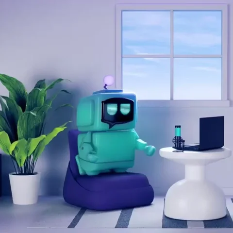

# Welcome to Happy Docs!
## Your 5* treatment destination for all ailments no questions asked.

<a href="#introduction">Introduction</a> | <a href="#main-features">Main Features</a> | <a href="#clone-the-repository">Clone the Repository</a> | <a href="#database-setup">Database Setup</a> | <a href="#Final_Words">Final_words</a> | <a href="#Created_by">Created_by</a> | 
<a href="#license">License</a>  

## Introduction

Welcome to Happy docs, your local no questions asked doctors surgery.
Been shot? we wont judge lets get you fixed up and back out on your way.
Discrete care whatever you need we've got you
Our top of line surgery will keep you fit and healthy, offering reminder appointments and complimentary wellness checks just give us a call today and we will get you booked in within 24 hours open 24/7.
### DISCLAIMER All patients must still be alive before booking an appointment please contact the funeral home for deceased patients

---

### Main Features:

- Customer database creation

- Insert into created with patients from my favorite TV Shows and Films, table format shown below:

⭐Patient Details

⭐Patient Contact

⭐Patient Address

⭐Prescription Orders

⭐Repeat Prescriptions

⭐Vaccinatons

⭐Patient Blood Tests

⭐Blood Test Results

⭐Deceased

The table structure has been created with normalisation in mind and table relationships worked to ensure the SQL database ran as i intended.

---

### clone-the-repository:

Feel free to clone this project and see how I set it all up, this was my very first project on my path into tech.\
To achieve this I took part in the 
🩷**Code First Girls**🩷 SQL kickstarter course, its free to sign up for and the mountain of experience I gained it was well worth the wait for a space on this amazing free course!

My Happy docs project recieved 🩷**Best in Class**🩷 an achievement I am very proud of especially as this is my very first exsposure to tech.

---

### Database Setup:

- Create the database first
- Use the database
- Create each table in the order they are setup in the create_tables.sql
- The go into the inserts_tables.sql and run these again in the order they have been shown in the file.
- My advanced features include a trigger(locating dead patients on file and removing them from database), if you would like to use this trigger it woruld need to be run prior to the insert into tables.
If run after the insert into file it does duplicate data so please keep this in mind.
- In advanced features you will find functions, procedures, triggers, scheduler, view and finally a group by to get information from multiple tables in one search.

---

### Final words:

I thoroughly enjoyed this project and am happy with what I have achieved as a first time introduction into tech and into SQL.

I hope in the future to combine this project with future projects to showcase my skills across multiple coding languages and broaden my knowledge further to use the work I have put into this database to support a larger project once my tech experience has developed further.

---

### Created by:

This project was created by Jessica Brown
I would like to take the time to thank Code First Girls for the SQL kickstarter course and my instructor Sam for teaching me the fundamentals of SQL so i could achieve what i have in this project.

🩷Please feel free to follow me on linkedin 🩷

https://www.linkedin.com/in/jb232020

---

### License:

[text](LICENSE)
